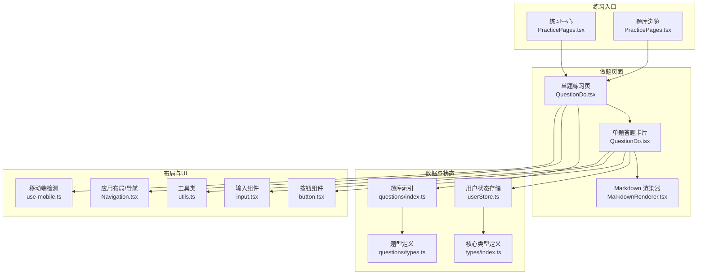
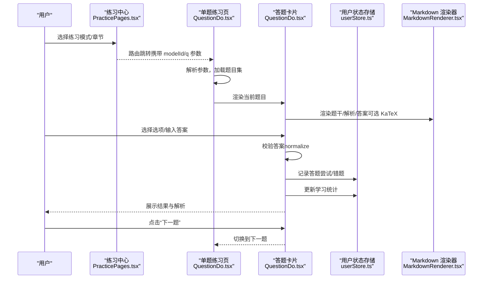
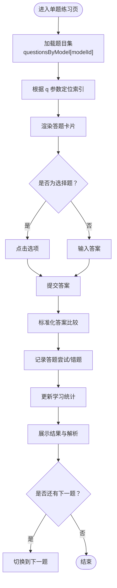
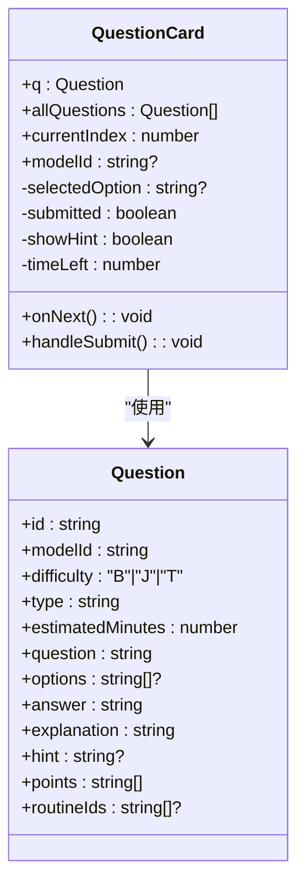
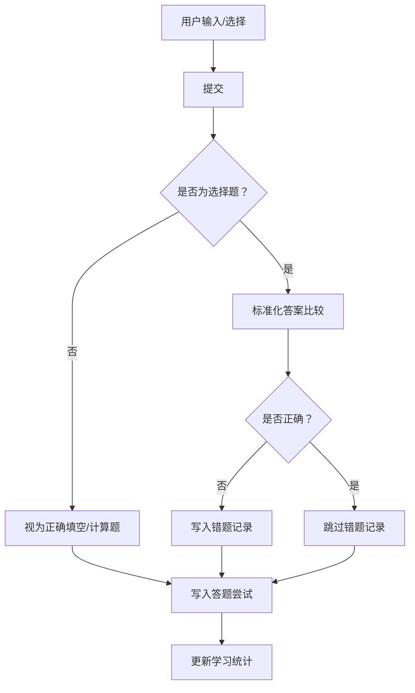
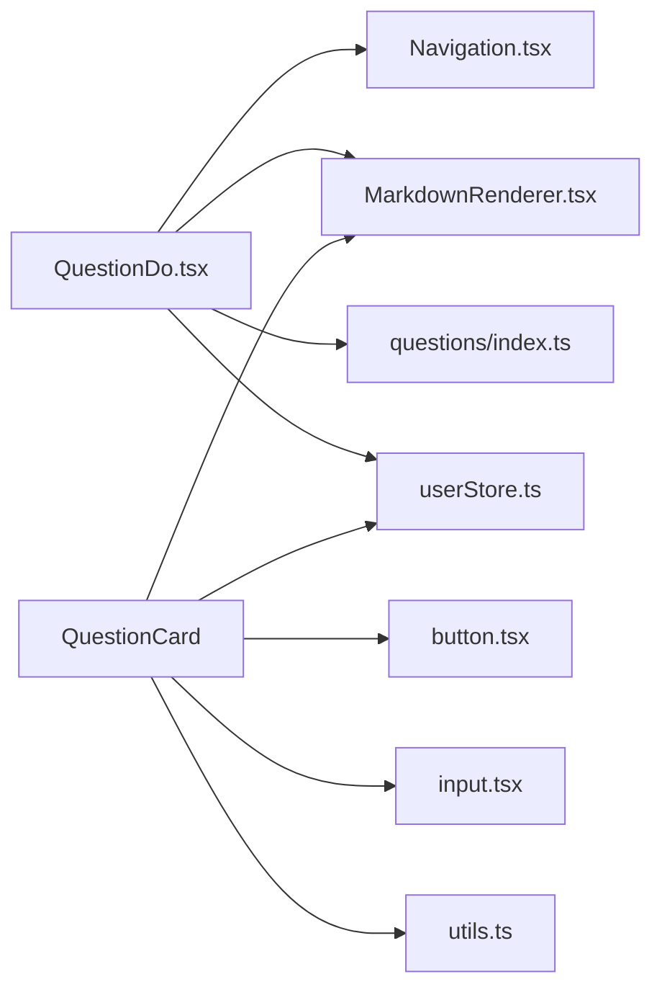

# 题目练习界面

<cite>
**本文引用的文件**
- [QuestionDo.tsx](file://src/sections/QuestionDo.tsx)
- [PracticePages.tsx](file://src/sections/PracticePages.tsx)
- [MarkdownRenderer.tsx](file://src/components/MarkdownRenderer.tsx)
- [userStore.ts](file://src/stores/userStore.ts)
- [index.ts](file://src/data/physics/questions/index.ts)
- [types.ts](file://src/data/physics/questions/types.ts)
- [Navigation.tsx](file://src/components/layout/Navigation.tsx)
- [input.tsx](file://src/components/ui/input.tsx)
- [button.tsx](file://src/components/ui/button.tsx)
- [use-mobile.ts](file://src/hooks/use-mobile.ts)
- [utils.ts](file://src/lib/utils.ts)
- [index.ts](file://src/types/index.ts)
</cite>

## 目录
1. [简介](#简介)
2. [项目结构](#项目结构)
3. [核心组件](#核心组件)
4. [架构总览](#架构总览)
5. [详细组件分析](#详细组件分析)
6. [依赖分析](#依赖分析)
7. [性能考虑](#性能考虑)
8. [故障排查指南](#故障排查指南)
9. [结论](#结论)
10. [附录](#附录)

## 简介
本文件围绕星耀平台“题目练习界面”进行系统化文档化，覆盖做题页面的用户界面设计、交互逻辑、实时反馈机制、题目渲染系统、答案输入与校验、答题进度与时间管理、自动保存与学习统计、多题型支持（选择题、填空题、计算题等）、移动端适配与无障碍支持，以及性能优化策略与用户体验建议。文档以代码为依据，结合可视化图表帮助不同背景读者理解。

## 项目结构
练习界面由“练习中心入口页”和“单题练习页”构成，配合全局布局、Markdown 渲染、用户状态存储与题库数据源，形成完整的做题闭环。

**图表来源**
- [PracticePages.tsx:88-184](file://src/sections/PracticePages.tsx#L88-L184)
- [QuestionDo.tsx:277-348](file://src/sections/QuestionDo.tsx#L277-L348)
- [MarkdownRenderer.tsx:19-32](file://src/components/MarkdownRenderer.tsx#L19-L32)
- [index.ts:14-17](file://src/data/physics/questions/index.ts#L14-L17)
- [types.ts:4-35](file://src/data/physics/questions/types.ts#L4-L35)
- [userStore.ts:46-236](file://src/stores/userStore.ts#L46-L236)
- [Navigation.tsx:690-719](file://src/components/layout/Navigation.tsx#L690-L719)
- [button.tsx:39-62](file://src/components/ui/button.tsx#L39-L62)
- [input.tsx:5-21](file://src/components/ui/input.tsx#L5-L21)
- [utils.ts:4-6](file://src/lib/utils.ts#L4-L6)
- [use-mobile.ts:5-18](file://src/hooks/use-mobile.ts#L5-L18)

**章节来源**
- [PracticePages.tsx:88-184](file://src/sections/PracticePages.tsx#L88-L184)
- [QuestionDo.tsx:277-348](file://src/sections/QuestionDo.tsx#L277-L348)

## 核心组件
- 练习中心入口页：提供“知识点练习/章节测试/题库浏览”等入口，并展示难度说明与章节导航。
- 单题练习页：承载题目渲染、选项选择/填空输入、提交与解析展示、进度与时间管理、提示开关、下一题导航。
- Markdown 渲染器：统一处理题干、解析、答案的 Markdown 渲染；支持可选的 KaTeX 渲染开关。
- 用户状态存储：记录错题、答题尝试、学习统计，持久化到本地存储。
- 题库数据：按模型分组的题目集合，提供难度标签与颜色映射。

**章节来源**
- [PracticePages.tsx:88-184](file://src/sections/PracticePages.tsx#L88-L184)
- [QuestionDo.tsx:50-275](file://src/sections/QuestionDo.tsx#L50-L275)
- [MarkdownRenderer.tsx:19-32](file://src/components/MarkdownRenderer.tsx#L19-L32)
- [userStore.ts:106-214](file://src/stores/userStore.ts#L106-L214)
- [index.ts:14-45](file://src/data/physics/questions/index.ts#L14-L45)

## 架构总览
做题流程从练习中心进入，通过路由参数选择模型或章节，进入单题练习页。页面根据题目类型渲染选项或输入框，用户提交后即时反馈正确与否，并记录答题尝试与错题，更新学习统计。

**图表来源**
- [PracticePages.tsx:186-241](file://src/sections/PracticePages.tsx#L186-L241)
- [QuestionDo.tsx:277-348](file://src/sections/QuestionDo.tsx#L277-L348)
- [MarkdownRenderer.tsx:19-32](file://src/components/MarkdownRenderer.tsx#L19-L32)
- [userStore.ts:106-214](file://src/stores/userStore.ts#L106-L214)

## 详细组件分析

### 单题练习页（QuestionDoPage）
- 路由参数解析：支持通过 modelId 与 q（题目ID）定位初始题目。
- 题目集加载：按模型ID从 questionsByModel 获取题目数组。
- 当前索引与进度：根据当前题目在数组中的位置计算进度条与页码。
- 翻题控制：提供上一题/下一题按钮，禁用边界状态。
- 时间管理：每题基于 estimatedMinutes 设置倒计时，提交后显示耗时。
- 实时反馈：提交后高亮正确/错误选项，展示参考答案与解析，显示知识点与套路链接。

**图表来源**
- [QuestionDo.tsx:277-348](file://src/sections/QuestionDo.tsx#L277-L348)
- [QuestionDo.tsx:50-275](file://src/sections/QuestionDo.tsx#L50-L275)
- [userStore.ts:106-214](file://src/stores/userStore.ts#L106-L214)

**章节来源**
- [QuestionDo.tsx:277-348](file://src/sections/QuestionDo.tsx#L277-L348)

### 答题卡片（QuestionCard）
- 选项渲染：选择题按字母顺序渲染选项，支持禁用与高亮。
- 输入组件：填空/计算题使用输入框，占位符提示输入格式。
- 提交逻辑：提交后锁定交互，展示正确/错误标识与参考答案。
- 提示系统：可折叠提示，点击切换显示/隐藏。
- 结果展示：包含解析、知识点标签、相关套路链接。

**图表来源**
- [QuestionDo.tsx:50-275](file://src/sections/QuestionDo.tsx#L50-L275)
- [types.ts:4-35](file://src/data/physics/questions/types.ts#L4-L35)

**章节来源**
- [QuestionDo.tsx:50-275](file://src/sections/QuestionDo.tsx#L50-L275)

### 题目渲染系统（MarkdownRenderer）
- 功能：统一处理 Markdown 内容渲染，支持可选 KaTeX。
- 设计：通过 props 控制是否启用 KaTeX；默认关闭，避免网络不稳定导致的渲染失败。
- 使用：在题干、解析、答案处调用，保证公式与文本一致渲染。

**章节来源**
- [MarkdownRenderer.tsx:19-32](file://src/components/MarkdownRenderer.tsx#L19-L32)

### 答案输入与校验
- 输入组件：选择题使用按钮，填空/计算题使用输入框。
- 标准化比较：去除 LaTeX 包裹符、反斜杠、空白字符，统一大小写，再进行比较。
- 错误记录：若为选择题且错误，写入错题记录；记录题目ID、学科、模型ID、我的答案、正确答案、得分等。
- 答题尝试：记录答题ID、题目ID、学科、模型ID、是否正确、耗时等。
- 学习统计：按学科聚合答题次数、正确/错误次数、掌握数与模型统计。

**图表来源**
- [QuestionDo.tsx:88-125](file://src/sections/QuestionDo.tsx#L88-L125)
- [userStore.ts:106-214](file://src/stores/userStore.ts#L106-L214)

**章节来源**
- [QuestionDo.tsx:88-125](file://src/sections/QuestionDo.tsx#L88-L125)
- [userStore.ts:106-214](file://src/stores/userStore.ts#L106-L214)

### 多题型支持
- 选择题：字母选项，提交后高亮正确/错误项。
- 填空题：数值答案输入，提交后展示参考答案。
- 计算题：提示写出步骤后自行对照，提交后展示参考答案。
- 扩展：题型标签映射至不同主题色徽标，便于识别。

**章节来源**
- [QuestionDo.tsx:28-48](file://src/sections/QuestionDo.tsx#L28-L48)
- [QuestionDo.tsx:150-193](file://src/sections/QuestionDo.tsx#L150-L193)

### 答题进度跟踪与时间管理
- 进度条：根据当前索引与总数计算宽度。
- 页码：显示“第 x / y 题”。
- 倒计时：每题基于 estimatedMinutes 初始化倒计时，提交后停止并显示耗时。
- 超时提醒：倒计时小于 60 秒时高亮显示。

**章节来源**
- [QuestionDo.tsx:318-343](file://src/sections/QuestionDo.tsx#L318-L343)
- [QuestionDo.tsx:63-81](file://src/sections/QuestionDo.tsx#L63-L81)

### 自动保存与学习统计
- 错题本：去重写入，避免重复记录同一题。
- 答题尝试：按时间倒序记录，便于回溯。
- 学习统计：按学科聚合，包含总次数、正确/错误数、掌握数、模型统计与最近一次答题时间。

**章节来源**
- [userStore.ts:106-214](file://src/stores/userStore.ts#L106-L214)

### 练习中心入口页
- 练习模式：知识点练习、章节测试、考试真题、竞赛练习（部分待上线）。
- 难度说明：B/J/T 三层难度与描述。
- 章节浏览：按章节列出模型，支持直接跳转练习。
- 题库浏览：按难度筛选与标签页查看。

**章节来源**
- [PracticePages.tsx:88-184](file://src/sections/PracticePages.tsx#L88-L184)
- [PracticePages.tsx:243-307](file://src/sections/PracticePages.tsx#L243-L307)
- [PracticePages.tsx:309-375](file://src/sections/PracticePages.tsx#L309-L375)

## 依赖分析
- 组件耦合
  - QuestionDoPage 依赖 Navigation 布局、MarkdownRenderer、userStore、questionsByModel。
  - QuestionCard 依赖 Button、Input、MarkdownRenderer、useUserStore、cn 工具。
- 数据依赖
  - 题库按模型分组，难度标签与颜色映射集中管理。
- 外部依赖
  - react-markdown 用于 Markdown 渲染；Lucide 图标库提供 UI 图标。
  - Zustand + persist 用于状态管理与本地持久化。

**图表来源**
- [QuestionDo.tsx:1-15](file://src/sections/QuestionDo.tsx#L1-L15)
- [Navigation.tsx:690-719](file://src/components/layout/Navigation.tsx#L690-L719)
- [MarkdownRenderer.tsx:19-32](file://src/components/MarkdownRenderer.tsx#L19-L32)
- [index.ts:14-17](file://src/data/physics/questions/index.ts#L14-L17)
- [userStore.ts:46-236](file://src/stores/userStore.ts#L46-L236)
- [button.tsx:39-62](file://src/components/ui/button.tsx#L39-L62)
- [input.tsx:5-21](file://src/components/ui/input.tsx#L5-L21)
- [utils.ts:4-6](file://src/lib/utils.ts#L4-L6)

**章节来源**
- [QuestionDo.tsx:1-15](file://src/sections/QuestionDo.tsx#L1-L15)
- [index.ts:14-17](file://src/data/physics/questions/index.ts#L14-L17)
- [userStore.ts:46-236](file://src/stores/userStore.ts#L46-L236)

## 性能考虑
- 渲染优化
  - 使用 useMemo 对 Markdown 预处理进行缓存，减少不必要的重渲染。
  - 单题卡片内部状态局部化，避免父组件变更引发整卡重渲染。
- 计时器管理
  - 进入新题目时清理旧计时器，防止内存泄漏与并发计时。
- 状态持久化
  - 使用持久化存储减少刷新丢失，同时避免频繁写入造成抖动。
- 移动端体验
  - 使用移动端断点检测，适配小屏交互与字体缩放。
- 可访问性
  - 按钮与输入框具备焦点可见边框与键盘可达性；图标具备语义化提示。

[本节为通用指导，无需特定文件引用]

## 故障排查指南
- 题目为空或未找到
  - 检查 modelId 是否正确，确认 questionsByModel 中是否存在该模型。
  - 检查路由参数 q 是否存在于题目数组中。
- 提交无响应
  - 确认选择了选项或输入了答案；提交按钮在空答案时禁用。
  - 检查 normalizeAnswer 的标准化逻辑是否符合预期。
- 错题未记录
  - 确认选择题错误分支已触发；检查重复记录去重逻辑。
- 学习统计未更新
  - 确认 updateLearningStats 已被调用；检查 attempts/wrongQuestions 的过滤条件。
- Markdown/KaTeX 渲染异常
  - 检查 MarkdownRenderer 的启用开关与内容格式；必要时关闭 KaTeX 以回退到原文显示。

**章节来源**
- [QuestionDo.tsx:291-300](file://src/sections/QuestionDo.tsx#L291-L300)
- [QuestionDo.tsx:88-125](file://src/sections/QuestionDo.tsx#L88-L125)
- [MarkdownRenderer.tsx:19-32](file://src/components/MarkdownRenderer.tsx#L19-L32)
- [userStore.ts:179-214](file://src/stores/userStore.ts#L179-L214)

## 结论
题目练习界面以清晰的页面结构、完善的交互与反馈机制、可扩展的题型支持与学习数据追踪为核心，结合 Markdown 渲染与本地状态持久化，为用户提供流畅、直观、可回溯的学习体验。通过持续优化渲染与计时器管理、增强移动端与无障碍支持，可进一步提升性能与可用性。

[本节为总结性内容，无需特定文件引用]

## 附录

### 题型与难度映射
- 题型标签映射：选择题、填空题、计算题分别对应不同主题色徽标与交互行为。
- 难度标签：B/J/T 与颜色映射集中管理，便于统一展示。

**章节来源**
- [QuestionDo.tsx:28-48](file://src/sections/QuestionDo.tsx#L28-L48)
- [index.ts:39-45](file://src/data/physics/questions/index.ts#L39-L45)

### 移动端适配与无障碍
- 断点：使用 768px 作为移动端断点，提供抽屉式导航与紧凑布局。
- 无障碍：按钮与输入框具备焦点样式与语义化图标；滚动区域支持键盘导航。

**章节来源**
- [use-mobile.ts:5-18](file://src/hooks/use-mobile.ts#L5-L18)
- [Navigation.tsx:455-547](file://src/components/layout/Navigation.tsx#L455-L547)
- [button.tsx:39-62](file://src/components/ui/button.tsx#L39-L62)
- [input.tsx:5-21](file://src/components/ui/input.tsx#L5-L21)